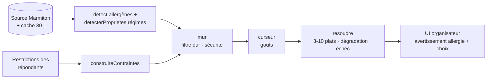

<div align="center">

# 🍽️ CookWho

### *Pour un repas qui convient à tous.*

> « N'ayez pas peur, vous allez forcément aimer le repas qu'on vous prépare. »

[](https://cookwho.fr)
[](https://cookwho.fr)
[](#-tests--qualité)
[](LICENSE)

</div>

---

## 📖 Présentation

**CookWho** simplifie l'organisation de **repas collectifs** en tenant compte des **contraintes alimentaires de chaque convive**. L'organisateur crée un repas, invite ses convives par un simple lien ; chacun déclare ses restrictions (allergies, régimes, aliments non-aimés) **sans créer de compte** ; CookWho croise le tout et propose **3 à 10 plats sûrs et adaptés à l'ensemble du groupe** — sans que l'organisateur ait à arbitrer.

> 🌐 **En ligne** : <https://cookwho.fr>

La promesse repose sur une règle non négociable : **jamais de plat dangereux proposé** (allergie/régime respectés), et un **filet de sécurité humain** quand une allergie est en jeu.

---

## ✨ Le parcours

1. **L'organisateur** se connecte (lien magique, sans mot de passe), crée un repas, ajoute des convives (prénoms) et **diffuse leurs liens d'invitation**.
2. **Chaque convive** ouvre son lien (aucun compte) et déclare en 3 étapes : **régime → allergies → aliments non-aimés** (avec un curseur de tolérance). Il ne voit **jamais** le menu.
3. **L'organisateur génère les recettes** : liste de 3-10 plats **compatibles avec tout le groupe**, avec avertissement d'allergie, signalement des ingrédients gênants en cas de compromis, puis **choisit son plat**.

Deux **univers étanches** (NFR5) : l'organisateur voit et choisit les recettes ; le participant ne voit *jamais* le menu.

---

## 🛠️ Stack technique

Application [T3 Stack](https://create.t3.gg/) — TypeScript de bout en bout.

| Domaine | Technologie |
|---|---|
| Framework | **Next.js 15** (App Router) · **React 19** |
| API typée | **tRPC v11** |
| Base de données | **PostgreSQL** ([Neon](https://neon.tech)) via **Prisma 6** |
| Authentification | **Auth.js v5** — lien magique par e-mail ([Resend](https://resend.com)) |
| UI | **Tailwind CSS v4** (thème « Cocon » maison) |
| Source de recettes | `marmiton-api` (scraper), derrière une abstraction + cache |
| Tests | **Vitest** + Testing Library (jsdom) |
| Hébergement | **Vercel** (+ Vercel Cron pour la purge RGPD) |
| CI | GitHub Actions (lint · typecheck · test · build) |

---

## 🏛️ Architecture & décisions structurantes

### Un noyau de domaine PUR (`src/core`)
Toute la logique de sécurité et de compatibilité vit dans `src/core`, **sans aucun I/O** (ni base, ni réseau, ni framework). Une règle ESLint (`no-restricted-imports`) interdit à `src/core/**` d'importer `~/server`, `~/app`, `~/trpc` ou Prisma. Résultat : un moteur **pur, déterministe et testable** sans mock.

- **Jamais d'exception** dans `/core` : les issues métier sont des **`Result` discriminés** (`{ ok: true } | { ok: false }`) ; c'est la couche tRPC qui les traduit en erreurs HTTP.
- **Le « mur » (sécurité) vs le « curseur » (goûts)** : le mur **exclut** strictement tout plat violant une allergie ou un régime ; le curseur ne fait que **classer** selon les aliments non-aimés. Le curseur ne franchit **jamais** le mur.
- **Modèle à 3 états** : un plat est *sûr*, *exclu*, ou ***incertain*** — jamais présenté « sûr » à tort quand la détection ne peut pas garantir.

### Le pipeline de génération



- **Détection par tokens**, jamais par sous-chaîne (« ail » ≠ « volaille ») ; dictionnaires maison (allergènes UE + propriétés de régime), validés par un **corpus d'or** (voir Sécurité).
- **Source de recettes interchangeable** (`SourceDeRecettes`) + **cache persistant** (fetch-through, résilience si la source casse, TTL 30 jours).
- **Orchestration côté serveur** (`genererPourRepas`) : compose la périphérie (DB, source) et le noyau ; testable sans réseau ni base réelle.

---

## 🗺️ Ce qui a été construit (les 5 epics du MVP)

| Epic | Contenu & décisions clés |
|------|--------------------------|
| **1 — Socle & accès organisateur** | Scaffold T3, thème « Cocon », **connexion par lien magique** (Auth.js v5 + Resend), espace « Mes repas », socle d'accessibilité. |
| **2 — Créer un repas & inviter** | Modèle `Repas`/`Participant`, **jeton d'accès 256 bits** (unique, indexé) par convive, diffusion des invitations, suivi des réponses, **purge planifiée RGPD** (cron 03:00 UTC, cascade). |
| **3 — Le participant déclare ses contraintes** | Assistant **3 étapes sans compte** (régime / allergies / non-aimés + curseur), récap + confirmation, modification possible, gestion des liens (expiré/invalide/clos). |
| **4 — Moteur de sécurité & compatibilité** | Dictionnaire **ingrédient→allergène** (14 allergènes UE) + **ingrédient→propriété** (viande/porc/poisson/fruits de mer/produit animal), détection, **mur** (allergies, régimes-allergènes *sans gluten/lactose*, régimes alimentaires *végétarien/vegan/pescétarien/sans porc*), **curseur**, **dégradation élégante**, **échec explicatif**, **génération forcée** (réponses partielles). *Halal/Casher différés (non certifiables depuis les ingrédients) → traités en « incertain ».* |
| **5 — Présentation & choix du plat** | UI organisateur : liste + **badge « X plats compatibles »**, **choix du plat persisté**, **ingrédients gênants + qui ils gênent**, **avertissement allergie + validation** (human-in-the-loop), état d'attente narratif. |

Le détail des choix (et les points différés) est tracé dans `_bmad-output/implementation-artifacts/` (stories) et `deferred-work.md`.

---

## 🔒 Sécurité — les invariants non négociables

- **NFR3 — Zéro faux négatif allergène.** La détection est validée par un **corpus d'or** avec une assertion **asymétrique** : un allergène attendu mais non détecté fait **échouer le build** (le CI passe au rouge). La sur-détection est tolérée (sens conservateur : « dans le doute, on exclut »).
- **NFR5 — Frontière étanche.** Recettes et menu sont **strictement réservés à l'organisateur** ; aucune route/vue participant ne les expose. Un **test de garde** vérifie qu'aucune procédure du router participant ne touche aux recettes.
- **FR16 — Human-in-the-loop.** Dès qu'une allergie est déclarée dans le groupe, retenir un plat exige une **validation explicite** de l'organisateur ; l'avertissement **complète** la détection algorithmique, il ne la remplace pas.
- **NFR4 — Auth par jeton.** Le participant s'authentifie par son seul lien (jeton 256 bits) ; l'`organisateurId` provient **toujours** de la session, jamais de l'entrée client.
- **NFR6 — Données de santé.** Aucune donnée de santé n'est journalisée ; la purge planifiée supprime les repas expirés (participants + restrictions en cascade).

L'invariant « aucune recette violant le mur n'est jamais retournée » est prouvé par des **property-tests** dans les trois modes (sûr / dégradé / forcé).

---

## 🚀 Lancer en local

### Prérequis
- **Node ≥ 20.11** (le CI tourne sur Node 22)
- Une base **PostgreSQL** (locale, Docker via `./start-database.sh`, ou un projet [Neon](https://neon.tech) gratuit)

### Étapes

```bash
# 1. Cloner + installer
git clone https://github.com/philzeg47/Cookwho.git
cd Cookwho
npm install

# 2. Configurer l'environnement
cp .env.example .env
#   → renseigne DATABASE_URL (Postgres). En dev, les autres variables
#     peuvent rester des valeurs factices non-vides (voir ci-dessous).

# 3. Créer les tables
npm run db:push

# 4. Démarrer
npm run dev            # http://localhost:3000
```

**Variables d'environnement** (`src/env.js`) : `DATABASE_URL`, `AUTH_SECRET`, `AUTH_RESEND_KEY`, `EMAIL_FROM`, `APP_URL`, `CRON_SECRET`.

> 💡 **Connexion en dev sans e-mail** : en `NODE_ENV=development`, le lien magique n'est **pas** envoyé par Resend — il est **imprimé dans la console** du serveur. Va sur `/connexion`, saisis un e-mail, puis copie le lien affiché dans le terminal.

---

## 🧪 Tests & qualité

```bash
npm run test        # Vitest — 287 tests (unitaires /core + composants + routers)
npm run lint        # ESLint (dont la frontière /core)
npm run typecheck   # tsc --noEmit
npm run build       # next build
```

La CI ([GitHub Actions](.github/workflows/ci.yml)) exécute **lint → typecheck → test → build** sur chaque PR et sur `main`.

---

## ☁️ Déploiement

CookWho est déployé sur **Vercel**, servi sur **[cookwho.fr](https://cookwho.fr)** (HTTPS automatique), avec le cron de purge natif (`vercel.json`) et les migrations Prisma versionnées (`prisma/migrations/`).

👉 Procédure complète (variables d'env, base, domaine, Resend, checklist) : **[`DEPLOYMENT.md`](DEPLOYMENT.md)**.

---

## 📁 Structure du projet

```
src/
├─ core/            # Domaine PUR (zéro I/O) — sécurité & compatibilité
│  ├─ allergenes/   # dico + normalize + detect + corpus d'or
│  ├─ regimes/      # dico ingrédient→propriété + détection + corpus
│  ├─ compatibilite/# mur · curseur · resoudre
│  └─ texte.ts      # matcher par tokens partagé
├─ server/          # tRPC, Prisma, auth, source de recettes + cache, orchestration
├─ app/             # Routes Next.js (organisateur protégé · participant par token)
├─ components/      # UI (ui/ · organisateur/ · participant/)
└─ lib/             # Données de référence (restrictions…)
```

---

## 🧭 Feuille de route

**Livré (MVP)** ✅
- [x] Accès organisateur (lien magique) & espace repas
- [x] Invitations + questionnaire de restrictions par participant (sans compte)
- [x] Moteur de recommandation sûr (mur + curseur), dégradation & échec explicatif
- [x] Présentation, avertissement allergie & choix du plat

**À venir**
- [ ] Régimes Halal / Casher (détection porc/alcool/fruits de mer + certification « incertain »)
- [ ] Source de recettes de secours (au-delà du scraper Marmiton)
- [ ] Menus complets (entrée / plat / dessert) & liste de courses
- [ ] Application mobile

---

## 👤 Auteur

- **Philippe Zeganath** — [@philzeg47](https://github.com/philzeg47)
- Site : <https://cookwho.fr>

---

## 📄 Licence

Distribué sous licence **MIT** — voir [`LICENSE`](LICENSE).

En résumé : usage, modification et redistribution **libres** (y compris à des fins commerciales), à condition de conserver la notice de copyright. Le logiciel est fourni « tel quel », sans garantie.
